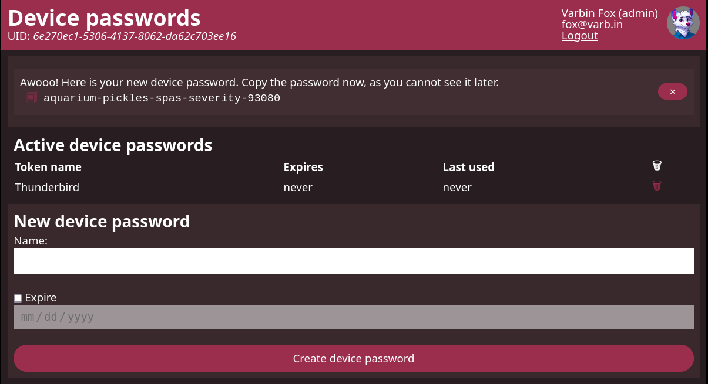

# Simple device password management



Device passwords fix the gap for accessing resources when clients do not support
the companies single-sign on protocol. The most prominent example is e-mail, 
where OAuth requires both server and client integration.

This software allows users to manage their own device passwords.

## Configuration

Configuration is based on environment variables.

| Variable                       | Meaning                                                                                                                          | Default                                                            |
|--------------------------------|----------------------------------------------------------------------------------------------------------------------------------|--------------------------------------------------------------------|
| `DP_SECRET_KEY`                | Secret key for signing the session cookies.                                                                                      | *Random generated*, set a fixed key one for a load balanced setup. |
| `DP_SQLALCHEMY_DATABASE_URI`   | URL to the database (any supported scheme supported by SQLAlchemy)                                                               | *None* (Mandatory)                                                 |
| `DP_OIDC_DISCOVERY_URL`        | [Discovery endpoint](https://openid.net/specs/openid-connect-discovery-1_0.html) of your identity provider.                      | *None* (Mandatory to set)                                          |
| `DP_OIDC_CLIENT_ID`            | Registered client id of the registered app.                                                                                      | *None* (Mandatory to set)                                          |
| `DP_OIDC_CLIENT_SECRET`        | Client secret of the registered app.                                                                                             | *None* (Recommended)                                               |
| `DP_OIDC_SCOPE`                | Scope to request, must include *openid*.                                                                                         | openid email profile                                               |
| `DP_OIDC_CLAIM_EMAIL`          | In what claim the user's mail address is found.                                                                                  | email                                                              |
| `DP_OIDC_CLAIM_EMAIL_VERIFIED` | What claim to check if the email has been verified. Set empty to accept all emails.                                              | email_verified                                                     |
| `DP_OIDC_CLAIM_USERNAME`       | In what claim the preferred username is found. In case your IdP does not hand out them, you may use the same value as for email. | preferred_username                                                 | 
| `DP_OIDC_REQUIRED_CLAIM`       | Require the given claim to be present to allow user access.                                                                      | *None*                                                             |
| `DP_OIDC_REQUIRED_CLAIM_VALUE` | Require the required claim to have a specific value.                                                                             | *None*                                                             |
| `DP_OIDC_GROUP_MEMBERSHIP`     | Require the given group membership to allow access.                                                                              | *None*                                                             |
| `DP_OIDC_GROUP_CLAIM`          | The group claim. The claim must be JSON array.                                                                                   | groups                                                             |                                                          |
| `DP_WORDLIST`                  | Path to the wordlist for the generated passwords. The container ships with *wordlist.txt* and *wordlist-de.txt*.                 | wordlist.txt                                                       |

The docker container contains drivers for sqlite, MySQL/MariaDB, Postgres and
(Microsoft) SQL Server by default.

## Database schema

For client integrations, two tables are relevant: `users` and `tokens`.

`users`:
 - primary (text): value of the *sub* claim
 - user (text): value of the configured username claim
 - email (text): value of the email claim
`tokens`:
 - primary (int): Internal identifier of the token
 - user (text): value of the configured username claim
 - name (text): user set name of the token
 - token (text): the device password, see the configuration for configuring hashing
 - expires (datetime, nullable): user configured expiration data

Use an `OUTER JOIN` to combine both tables.
For dovecot, you can use the following query 
(assuming an unhashed setup):

```sql
SELECT email as user, token as password 
FROM users 
LEFT OUTER JOIN tokens t ON users."primary" = t.user
WHERE user = '%n'
```

## Caveats

 - Only a single identity provider is supported.
 - Username and e-mail-address of a user is updated (only) on user login.
 - It is assumed the identity provider controls access to its apps and user registration.
 - The application assumes email-adresses and usernames are unique for your IdP.
   If you use a "public IdP" (such as Microsoft or Google), estrict app access 
   to your tenant.

