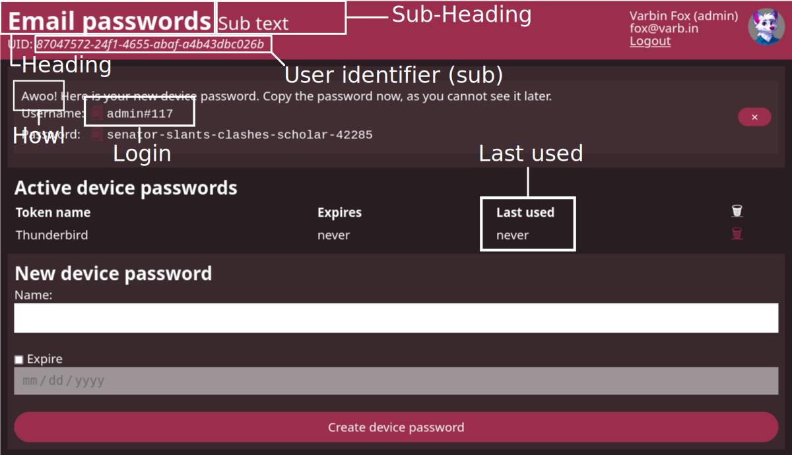

# User interface customization

## Configurable elements

There are various elements that can be toggled globally. The following 
elements can be customized by setting the appropriate variables:

- `DP_UI_HEADING`: Heading, the default is "Device Passwords"
- `DP_UI_HEADING_SUB`: Add a subtext after "Device Passwords", none by default
- `DP_UI_SUB`: Show the subject identifier below the heading, on by default.
- `DP_UI_LAST_USED`: Show last used timestamp for each device password, disabled by default. You must use database-side password validation for the last used time to be updated.
- `DP_UI_NO_AWOO`: Do not display "Awooo!" after creating the device passwords. By default the system howls.

The following picture displays each element: 



## Using a custom style

The theme colors are define in the `extra.css` file.
Simply bind-mount an alternate version into the docker container to override it.
The following shows the default:

```css
:root {
    --text-color: black;
    --background-color: white;

    --accent-color: #b9385d; /* (1)! */
    --on-accent-color: white; /* (2)! */

    --error: #660000;

    --layer: #ddd8; /* (3)! */

    --font: "Noto Sans", "Open Sans", Helvetica, Arial, sans-serif; /* (4)! */
    --font-devicepassword: "Cascadia Code", "Liberation Mono", Menlo, Monaco, Consolas, monospace; /* (5)! */
    --font-size: 14pt;
}

@media (prefers-color-scheme: dark) { /* (6)! */
    :root {
        --text-color: white;
        --background-color: black;
        --accent-color: #9b2e4d;
        --on-accent-color: white;

        --error: #990000;

        --layer: #3338;
    }
}
```

1. Main theme color
2. Text color legible on the theme color.
3. Color for the stackable layers. The color must have transparency. It will always be mixed with the theme color automatically.
4. Default font for all text.
5. Font used to show the generated password.
6. Override colors for a dark color theme is this section.