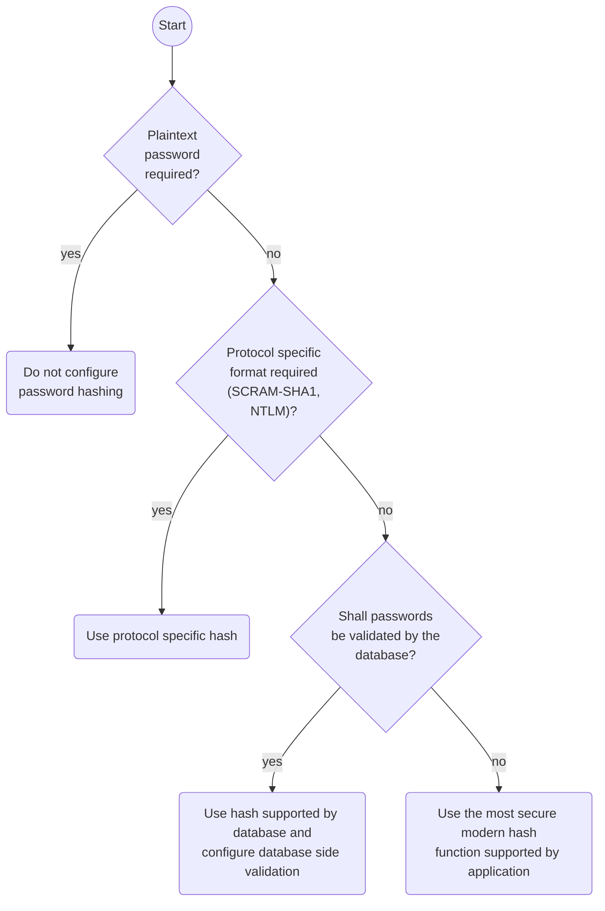

# Configure password hashing

Passwords are usually stored encoded by a one way function, a hash function.
Even if an attacker gets access to the database, 
they can only access the hash values and not use the password to login.
Additionally, users often choose easy-to-guess password and reuse them across devices.

On the other hand most of the attacks against passwords do not apply for device passwords:
They are narrowly scoped and random-generated.
Still password hashing is a good hardening measure.
As the device passwords are unique and random,
even hash functions inadequate for regular passwords may be found acceptable.

## Choice of the password hash

To choose an appropriate password hash, consider the following steps:

 - Does your client application need plaintext passwords? If yes, you cannot configure hashing.
 - Do some features of your client application need a certain type of hash (e.g. SCRAM-SHA1 or NTLM)? If yes, use the required hash.
 - Do you want to configure database side [database-side password validation](password-validation.md)? If yes, see the respective page on what is supported.
 - What hash functions does your client application support?

!!! note "Password hash migration"

    Changing the password hash value if entries are already in the database
    will not change the stored entries.
    It generally is unsupported to migrate between hashes.

## Supported values

Below is a list of hashes and their respective features.

Plaintext storage:

 - `plaintext`, `roundup_plaintext`: 
   Not a hash, but stores the password in plain text.
   The _roundup_ variant prefixes the password with `{plaintext}`.

General hashes:

 - `hex_md5`, `hex_sha1`, `hex_sha256`, `hex_sha512`: 
   The respective hashes. Those hashes are only supported for compatibility.
 - `ldap_md5`, `ldap_sha1`: MD5/SHA1 hash of the password,
   base64 encoded and prefixed with `{MD5}`/`{SHA1}`.
   Those hashes are only supported for compatibility.
   They are not build for password storage, but are still better than plaintext.
 - `ldap_salted_md5`, `ldap_salted_sha1`, `ldap_salted_sha256`, `ldap_salted_sha512`:
   Salted variants of the hashes. 
   Prefixed with `{S<hash>}` (e.g. `{SMD5}`).
 - `md5_crypt`, `sha1_crypt`, `sha256_crypt`, `sha512_crypt`, `ldap_..._crypt`: 
   These are the respective UNIX crypt algorithms. 
   The SHA256 and SHA512 variants are considered modern algorithms.  
   All LDAP variants are prefixed with `{CRYPT}`.
 - `bcrypt`, `ldap_bcrypt`: The bcrypt hashing algorithm. 
   The LDAP variant is prefixed with `{CRYPT}`. 
   It is considered a modern algorithm.
 - `scrypt`: Memory hard *scrypt* algorithm.
   It is considered a modern algorithm but is preferable to replace it with 
   Argon2.
 - `argon2`: Most modern algorithm.

Protocol specific hashes:

 - `nthash`: Required for NTLM authentication.
 - `scram`: Required for the SCRAM authentication. 

Application specific hashes:
 - `dovecot_scram_sha1`, `dovecot_scram_sha256`:
   Dovecot specific hash for SCRAM authentication.
   They are considered modern algorithms.
   
