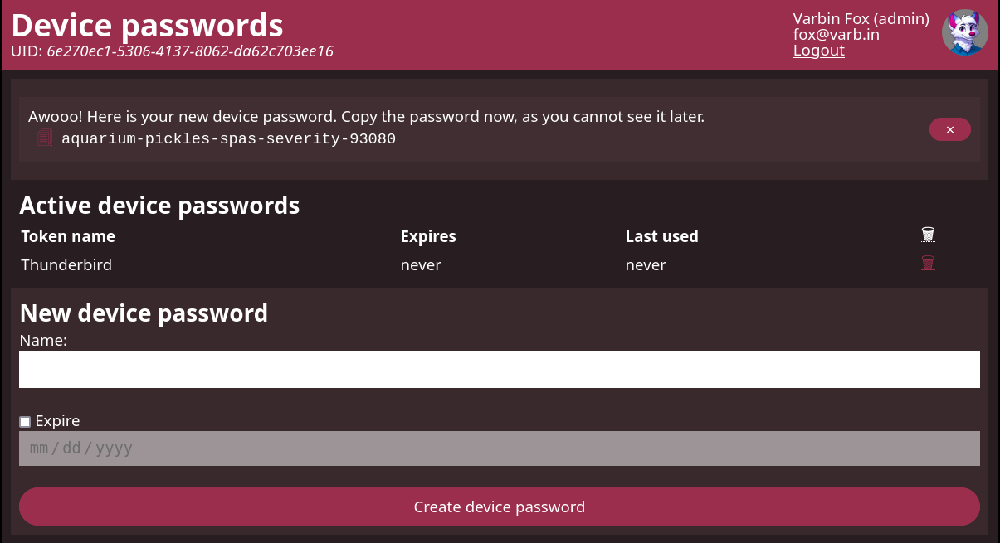

# Home

In the modern day, authentication with only passwords shows increasing weaknesses:
They are reused and often compromised.
Instead, multifactor authentication together with web-based single sign-on (SSO) is deployed.
Unfortunately, many applications are unable to implement such methods.
A classic example is email, where the only reliably widespread login method is using a password.

The device password manager aims to fill this gap:
After signing in with SSO, users can create unique passwords for their devices to login to such systems.

## Documentation structure

The documentation is organized in the following way:

 - The [Tutorial](tutorial/index.md) gets you started. 
   They take you by your hands or paws to get you running.
 - [How-to](how-to/index.md) articles discuss topics at a high level to solve specific problems.
 - In the [Reference](reference/index.md) you can find technical documentation on a low 
   level.

## Example

